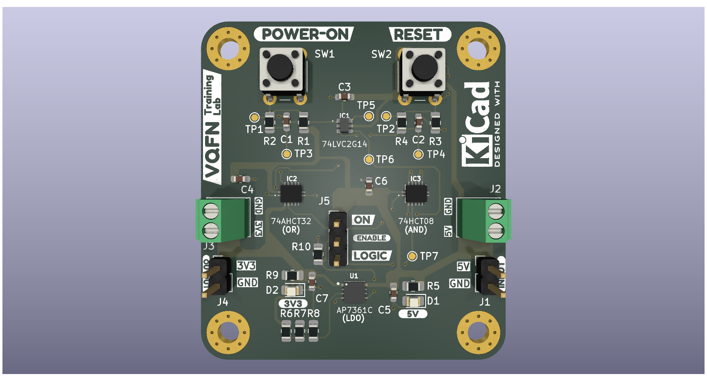
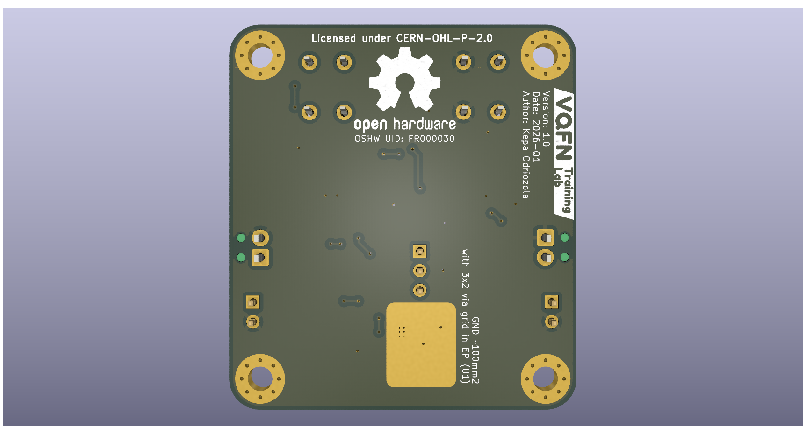

# VQFN_Training_Lab
PCB Design for a VQFN and DFN package soldering practice board using an LDO regulator

## Project Description
This project features a power supply circuit centered on the AP7361C (DFN) LDO regulator. It converts a 2.2V to 6.0V input into a stable 3.3V output with ±1% accuracy. To manage power, SW1 (POWER ON) and SW2 (RESET) pulses are debounced by a 74LVC2G14 Schmitt-Trigger inverter (TSSOP6). A 74AHCT32 (VQFN) OR gate creates a latch, while a 74HCT08 (VQFN) AND gate acts as a kill switch to maintain Enable signal only if the latch is active and RESET is not pressed. 2 green LEDs (D1, D2) provide visual feedback status for the +5V and +3V3 rails.

## 3D Render

## Tools Used
KiCad: 9.0.4

\## Licensing and Open Source Hardware
This project is certified as \*\*Open Source Hardware\*\*. 

\### Hardware License
The hardware design files are licensed under the \*\*CERN Open Hardware Licence Version 2 - Permissive (CERN-OHL-P-2.0)\*\*. 
> You may redistribute and modify this documentation and build products based on it under the terms of the CERN-OHL-P v2.0.

\### Documentation License

All associated documentation, including manuals and images, is licensed under \*\*Creative Commons Attribution-ShareAlike 4.0 International (CC BY-SA 4.0)\*\*.

